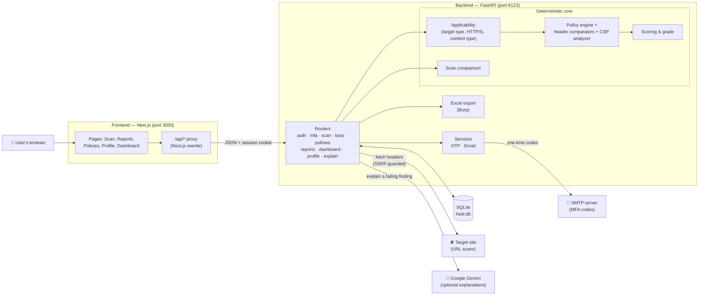
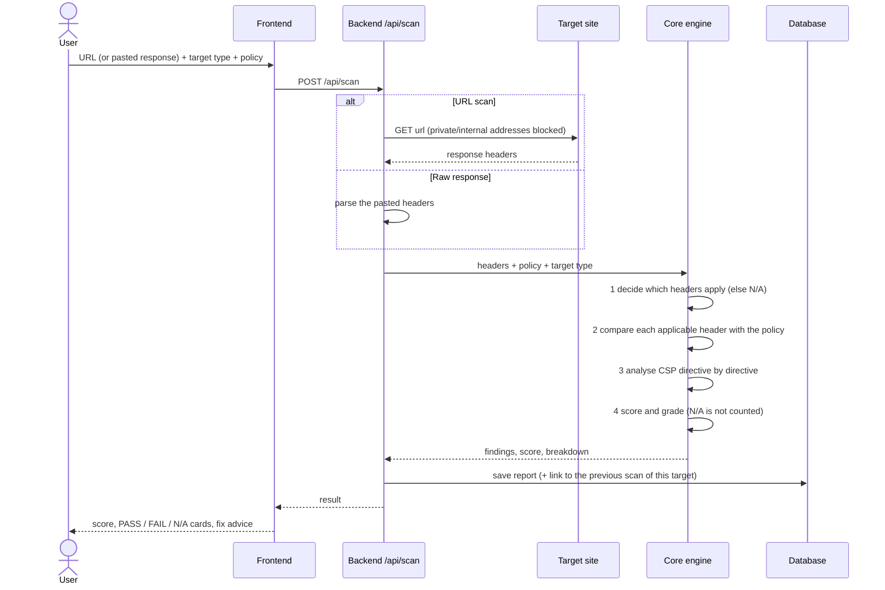
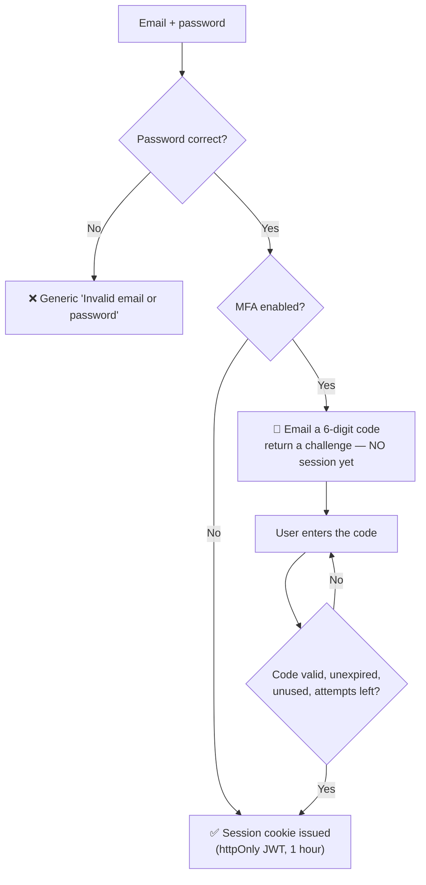

# 🛡️ Hedr — Project Overview

How the whole project works, how to set it up and run it, what it's built with, and where it stands today.

## 📑 Contents

- [What Hedr is](#-what-hedr-is)
- [Architecture](#-architecture)
- [How a scan works](#-how-a-scan-works)
- [How sign-in and MFA work](#-how-sign-in-and-mfa-work)
- [Technologies used](#-technologies-used)
- [Project structure](#-project-structure)
- [Setup and run](#-setup-and-run)
- [Configuration](#-configuration)
- [Main API areas](#-main-api-areas)
- [Data model](#-data-model)

---

## 🎯 What Hedr is

- A web app that checks the **security headers** a site or API returns against a **policy you define**.
- Not just "is the header present?" — it asks **"does it match what we decided it should be?"**
- Every result is decided by **fixed rules** (no AI), so the same input always gives the same answer.
- AI (Google Gemini) is **optional** and only *explains* a failure — it never decides pass or fail.

---

## 🏗️ Architecture

Two apps that talk over HTTP, plus a database and a few outside services.



**How to read it**

- 🖥️ **Frontend** — the pages you see. It never talks to the database; it calls `/api/...`, which Next.js forwards to the backend.
- ⚙️ **Backend** — routers receive requests and hand the work to the **deterministic core** (applicability → policy engine → scoring).
- 🗄️ **Database** — one SQLite file; stores users, policies, reports, Burp imports and MFA data.
- 🌍 **Outside services** — the site being scanned, an SMTP server (only for MFA) and Gemini (only for "Explain with AI").

---

## 🔎 How a scan works



- 🧭 **Applicability** — decided by target type (Web Application, REST API, API Gateway, Custom), HTTP vs HTTPS, and content type. Not-applicable headers are shown as **N/A** and never lower the score.
- 🧠 **Comparison by meaning** — spacing, ordering and casing differences don't cause false failures.
- 📈 **Comparison with the previous scan** — computed on demand from two saved reports; there's no separate comparison table.
- 📦 **Burp History Import** uses the *same* engine: each entry is run through it, then results are rolled up per header and per endpoint and can be exported to Excel.

---

## 🔐 How sign-in and MFA work



- 🔑 Sessions are a JWT in an **httpOnly** cookie (`SameSite=Lax`). There is no server-side session list.
- 🔢 MFA codes: 6 digits from a secure random generator, **stored only as a keyed hash**, valid 5 minutes, single use, voided after 5 wrong tries.
- ⏱️ Limits: 30-second resend cooldown and 3 codes per 10 minutes per user.
- 🚫 Until the code is verified there is **no session**, so no authenticated endpoint can be reached.
- 🚪 Turning MFA off needs the **current password and** an emailed code.
- 📝 Signing up does **not** log you in — you're sent to the login page.

---

## 🧰 Technologies used

| Layer | Technology |
| --- | --- |
| 🖥️ Frontend | **Next.js 15**, **React 19**, **TypeScript** |
| 📄 PDF export | `jspdf`, `jspdf-autotable` |
| ⚙️ Backend | **FastAPI** (Python), **Uvicorn**, **Pydantic 2** |
| 🗄️ Database | **SQLite** via **SQLAlchemy 2** |
| 🔐 Auth | **PyJWT** (session cookie), **bcrypt** (password hashing) |
| 📧 Email | Python `smtplib` (plain SMTP, no extra service) |
| 🌐 Fetching targets | `httpx` (with an SSRF guard) |
| 📦 Burp parsing | `defusedxml` (safe XML parsing) |
| 📊 Excel export | `openpyxl` |
| 🤖 AI (optional) | **Google Gemini** (`google-genai`) |
| 🧪 Tests | **pytest** (+ `pytest-cov`) |

---

## 🗂️ Project structure

```text
.
├── backend/
│   ├── app/
│   │   ├── main.py            # app setup, routers, startup (create tables, seed baselines)
│   │   ├── config.py          # settings read from .env
│   │   ├── database.py        # SQLite engine + small schema updater
│   │   ├── models.py          # database tables
│   │   ├── schemas.py         # request / response shapes
│   │   ├── routers/           # API endpoints: auth, mfa, scan, burp, policies,
│   │   │                      #   reports, dashboard, profile, explain
│   │   ├── core/              # the deterministic engine:
│   │   │                      #   applicability, policy_engine, comparators,
│   │   │                      #   csp_analyzer, scoring, scan_comparison,
│   │   │                      #   burp_import / burp_aggregation, excel_export,
│   │   │                      #   fetcher (SSRF-guarded), header_parser
│   │   ├── services/          # email_service, otp_service (MFA)
│   │   └── baselines/         # built-in policies: basic, strict, saas, fintech
│   ├── tests/                 # pytest suite
│   ├── requirements.txt
│   └── .env.example
├── frontend/
│   └── src/
│       ├── app/               # pages: dashboard, scan, reports, policies, profile, login, signup
│       ├── components/        # reusable UI (cards, dropdowns, modals, MFA code step…)
│       └── lib/               # API client, types, PDF/CSV/JSON export, themes, helpers
├── docs/screenshots/          # images used in README.md
├── Hedr_Project_Overview.md   # this file
└── README.md
```

---

## 🚀 Setup and run

### ✅ Prerequisites

- 🐍 **Python 3.10+**
- 🟢 **Node.js 18+** (with npm)
- 📧 *(optional)* an SMTP account if you want two-factor sign-in
- 🤖 *(optional)* a Gemini API key if you want "Explain with AI"

### 1️⃣ Start the backend

```bash
cd backend
python3 -m venv venv
source venv/bin/activate          # Windows: venv\Scripts\activate
pip install -r requirements.txt
cp .env.example .env              # then edit it (see Configuration)
uvicorn app.main:app --reload --port 8123
```

- 📍 The API runs at **http://127.0.0.1:8123**.
- 🗄️ On first start it creates the SQLite file (`backend/hedr.db`) and adds the four built-in baseline policies.
- 📚 Interactive API docs: http://127.0.0.1:8123/docs

### 2️⃣ Start the frontend

In a **second terminal**:

```bash
cd frontend
npm install
npm run dev
```

- 📍 The app runs at **http://localhost:3000**.
- 🔀 It forwards `/api/*` to the backend on port **8123**. If your backend uses another port, start the frontend with `NEXT_PUBLIC_API_BASE_URL=http://127.0.0.1:<port>`.

### 3️⃣ Use it

- 🆕 Open http://localhost:3000/signup and create an account.
- 🔑 You're sent to the login page — log in.
- ▶️ Open **Scan**, enter a URL, choose a target type and a policy (try the **Strict** baseline), and click **Scan**.

### 🧪 Run the tests

```bash
cd backend
source venv/bin/activate
pip install -r requirements-dev.txt
pytest
```

- ✔️ The tests use a throwaway database and a fixed test secret — they never touch your real `hedr.db`.
- ✔️ Check the frontend types with `cd frontend && npx tsc --noEmit`.

---

## ⚙️ Configuration

Settings live in `backend/.env`.

| Setting | Required | Purpose |
| --- | --- | --- |
| `JWT_SECRET_KEY` | **Yes** | Signs login sessions and keys the MFA code hash. Generate with `python -c "import secrets; print(secrets.token_hex(32))"`. |
| `GEMINI_API_KEY` | No | Enables "Explain with AI". |
| `GEMINI_MODEL` | No | Which Gemini model to use. |
| `COOKIE_SECURE` | No | Keep `false` for local `http://localhost`; set `true` over HTTPS. |
| `SMTP_HOST`, `SMTP_PORT`, `SMTP_SECURITY`, `SMTP_USERNAME`, `SMTP_PASSWORD`, `SMTP_FROM` | Only for MFA | Where verification codes are sent from. `SMTP_SECURITY` is `starttls`, `ssl` or `none`. |
| `OTP_*`, `MFA_*` | No | Tune code lifetime, attempts and rate limits (sensible defaults are built in). |

- 📧 With Gmail, use an **app password**, not your normal password.
- 🔁 Restart the backend after changing `.env`.
- 🙈 `.env` is git-ignored — never commit it.

---

## 🔌 Main API areas

| Area | Base path | What it does |
| --- | --- | --- |
| 🔑 Auth | `/api/auth` | register, login, logout, current user |
| 🔐 MFA | `/api/mfa` | status, enable, disable, verify the sign-in code, resend |
| 🔎 Scan | `/api/scan` | run a scan; list target types and their N/A headers |
| 📦 Burp | `/api/burp` | import a history file, analyze, results, Excel export |
| 📚 Policies | `/api/policies` | create, edit (versioned), clone, delete; built-in baselines |
| 🧾 Reports | `/api/reports` | list, view, delete, export, comparison, score history |
| 📊 Dashboard | `/api/dashboard` | totals and recent scans |
| 👤 Profile | `/api/profile` | account details, preferences (theme, accent, default policy), password |
| 🤖 Explain | `/api/explain` | AI explanation for one failing finding |

- 🔒 Every endpoint needs a valid session except register, login, logout and health.
- 👥 Every policy, report and import belongs to one account; other accounts get a `404`, never the data.

---

## 🗃️ Data model

| Table | Holds |
| --- | --- |
| `users` | accounts (bcrypt password hash, profile fields, theme/accent, default policy) |
| `policies` | header rules + optional CSP rules, version number, baseline flag, owner |
| `scan_reports` | one saved scan: target, target type, policy used, findings, score, grade |
| `burp_imports` | an imported Burp history, its filters and the stored analysis |
| `user_mfa` | whether MFA is turned on for a user |
| `email_otp_challenges` | issued one-time codes (hashed), expiry, attempts, purpose |

- 🧱 There are no database migrations; a small startup step (`ensure_schema`) adds new columns to an existing `hedr.db`.
- 🗑️ Raw response bodies and full header dumps are deliberately **not** stored in reports — only the findings for the headers the policy named.

---

See also: the project [`README.md`](README.md) for a short user guide.
