# Hedr — HTTP Security Header Policy Analyzer

Most header checkers only ask *"is the header present?"* Hedr asks
**"does it match the policy you defined?"** — and tells you what passes,
what fails, and how to fix it.

## What it does

- **Scan** a live URL, paste a raw HTTP response you already have, or import a Burp Suite HTTP history.
- **Policies** — write your own or start from a built-in baseline (Basic, Strict, SaaS, Fintech).
- **Clear pass/fail** — decided by rules, not AI. Values are compared by meaning, so spacing or ordering differences don't cause false failures.
- **Target types** — tell Hedr whether you're scanning a Web Application, REST API or API Gateway. Headers that don't apply (for example CSP on a JSON API) show as **N/A** and never lower your score.
- **CSP analysis** — checks your Content-Security-Policy against your policy and against common best practices.
- **Score and grade** for every scan, saved as a report you can export (PDF, CSV, JSON).
- **Changes since the previous scan** — see what improved or regressed for the same target.
- **AI explanations** (optional) — a plain-English "why it matters and how to fix it" for any failing finding. The AI never decides pass/fail.
- **Two-factor sign-in** (optional) — protect your account with a one-time code sent to your email.

## Tech stack

Next.js + TypeScript (frontend) · FastAPI + SQLite (backend) · Google Gemini (optional AI)

## Install and run

You need Python 3.10+ and Node.js 18+.

**1. Backend**

```bash
cd backend
python3 -m venv venv && source venv/bin/activate
pip install -r requirements.txt
cp .env.example .env      # then set JWT_SECRET_KEY (see Configuration)
uvicorn app.main:app --reload --port 8123
```

**2. Frontend** (in a second terminal)

```bash
cd frontend
npm install
npm run dev
```

**3. Open the app** at **http://localhost:3000**.

> The frontend talks to the backend on port **8123**. If you run the backend on a
> different port, start the frontend with `NEXT_PUBLIC_API_BASE_URL=http://127.0.0.1:<port>`.

## Your first scan

A walkthrough from a fresh install to your first report.

### 1. Create an account

Open http://localhost:3000/signup, enter your name, email and a password (at least 8 characters), then click **Sign up**.

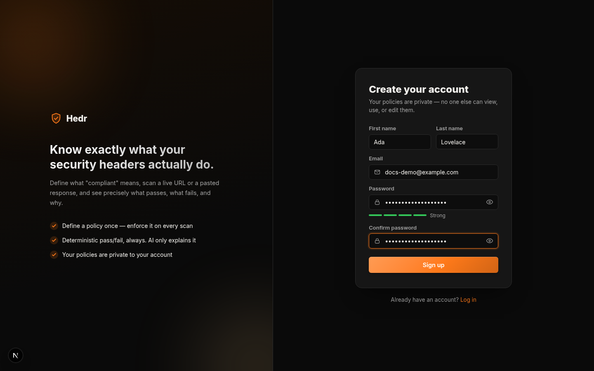

### 2. Log in

You're sent to the login page with an "Account created" message. Log in with the email and password you just chose.

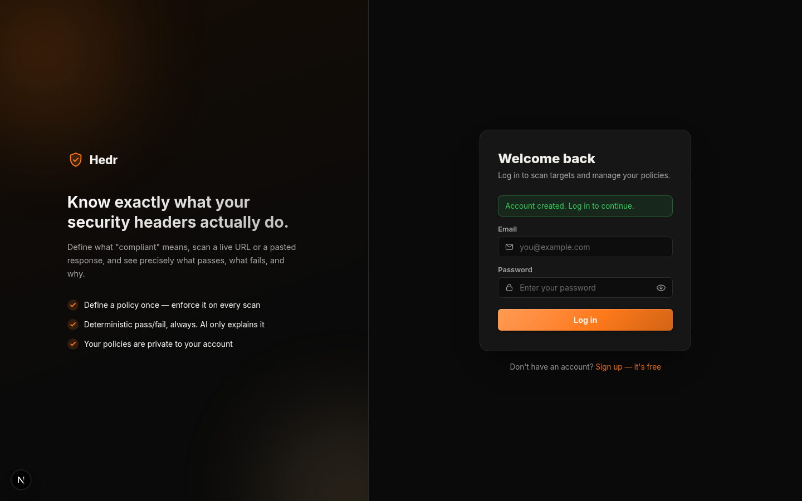

### 3. Your dashboard

After logging in you land on the dashboard. It shows your totals, your latest scan and recent scans — empty until you run your first scan. Click **+ New Scan** (or **Scan** in the sidebar).

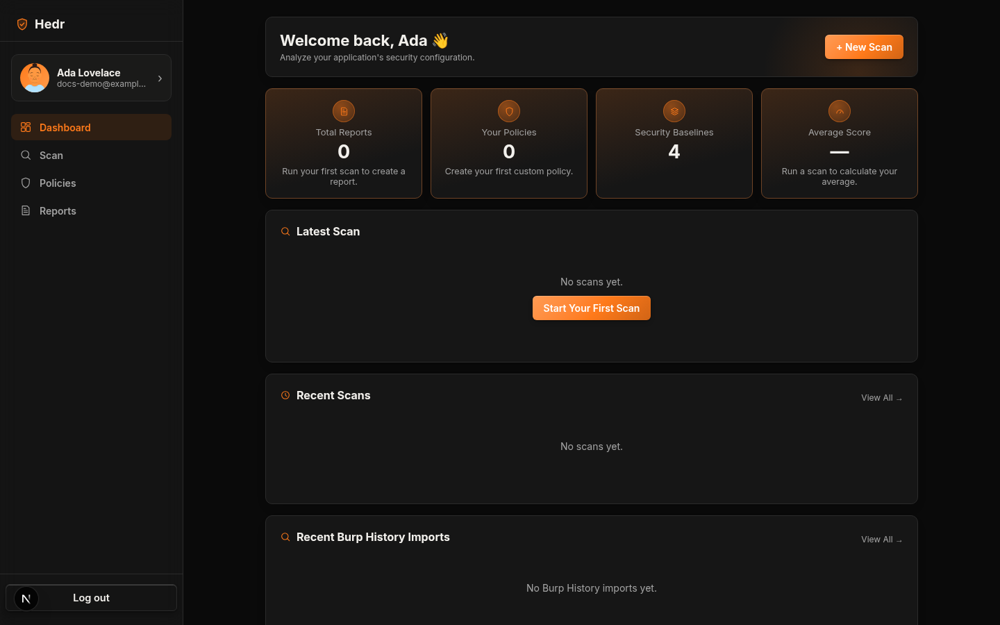

### 4. Set up the scan

On the **Scan** page, with the **URL** tab selected:

1. **Target URL** — enter the address to check, e.g. `https://github.com`. Hedr fetches it from the server and reads the response headers.
2. **Target Type** — pick what you're scanning:
   - **Web Application** — a browser-facing site (all headers apply).
   - **REST API** or **API Gateway** — browser-only headers such as CSP and X-Frame-Options are marked **N/A** by default.
3. **Policy** — pick the rules to check against. New accounts have four built-in **Baselines**: *Basic*, *Strict*, *SaaS Application* and *Fintech*. *Strict* is a good first choice.

Then click **Scan**.

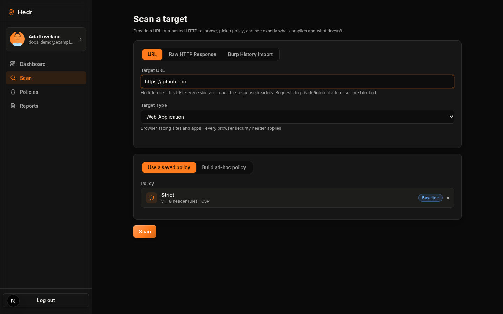

> Hedr blocks requests to private or internal addresses on purpose. For a site only reachable
> through a VPN or internal network, copy its headers and use the **Raw HTTP Response** tab instead
> (see below).

### 5. Read the result

The result shows your **score and grade**, how many checks passed and failed, and a card for every header in the policy.

- **PASS** — the header matches the policy.
- **FAIL** — the header is missing or doesn't match. The card shows what the policy expects, what was actually sent, the problem, and how to fix it. Click **Explain with AI** (if you set a Gemini key) for a plain-English explanation.
- **N/A** — the header doesn't apply to this target (for example HSTS on a plain-HTTP page, or CSP on a REST API). It is shown with the reason and is **not** counted in the score.

Use **Export** to download the result as PDF, CSV or JSON.

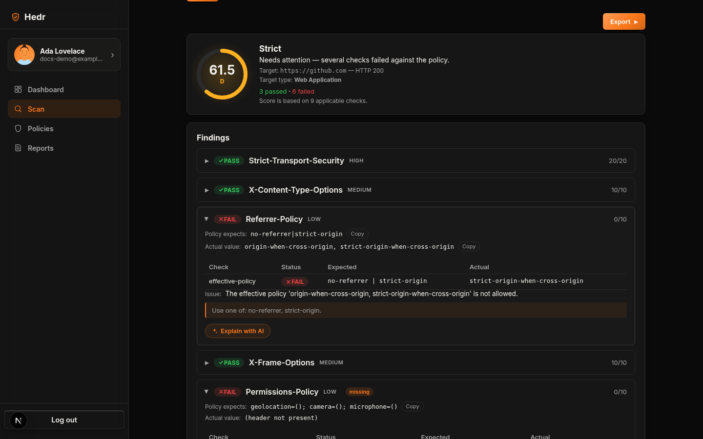

### 6. Find it again later

Every scan is saved automatically. Open **Reports** in the sidebar to see all of them — search, filter by grade, policy or date, and export in bulk.

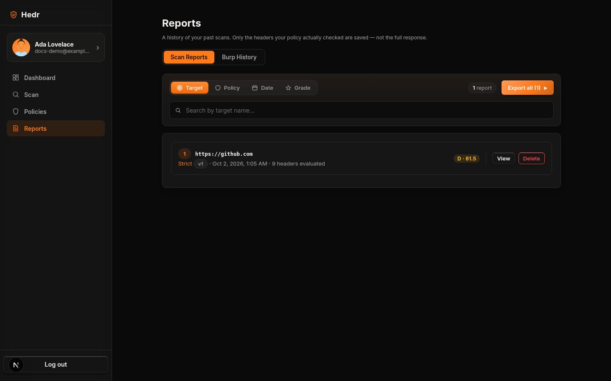

Click a report to see its full findings, a **Score History** chart for that target, and **Changes Since Previous Scan** (what improved or got worse since the last time you scanned the same target with the same policy).

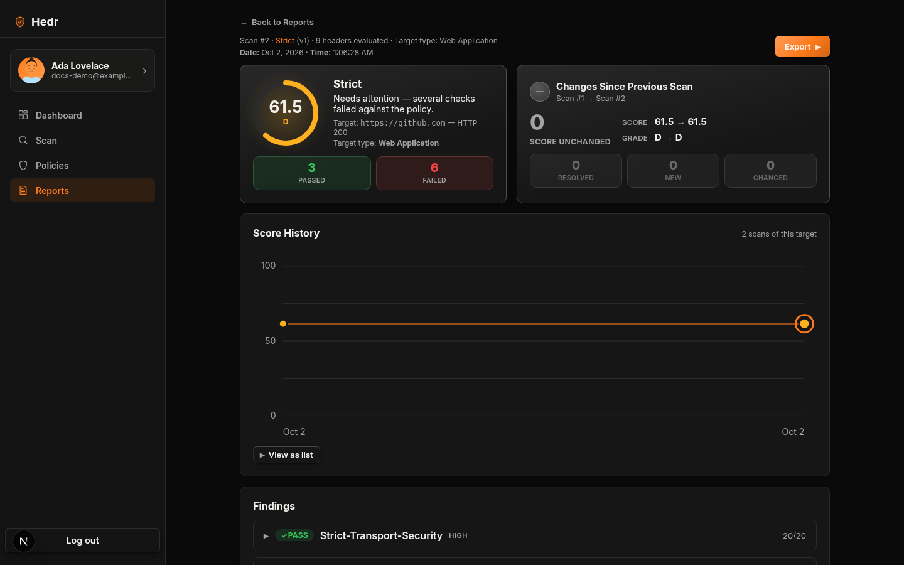

## Other ways to scan

### Raw HTTP Response

Already have a response (from `curl -i`, your browser's dev tools, or a proxy)? Open the **Raw HTTP Response** tab, enter the **Target URL** the response came from (it's only used to match future scans of the same target — Hedr never fetches it), optionally give it a name, pick a **Target Type**, paste the response, and scan. Click **Fill example** to see the expected format.

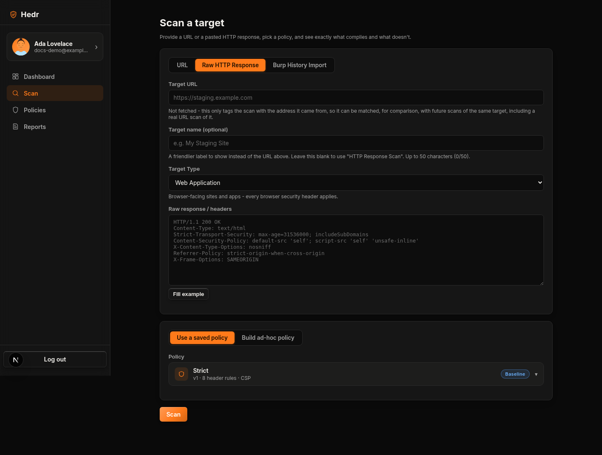

### Burp History Import

Open the **Burp History Import** tab, drop in a Burp Suite HTTP-history export (XML), choose which hosts, methods, status codes and content types to include, pick a **Target Type** and a **Policy**, and click **Analyze**. You get one report covering every endpoint: coverage per header, findings grouped by header, inconsistencies between endpoints, and an Excel export (Summary, Policy, per-endpoint results and findings).

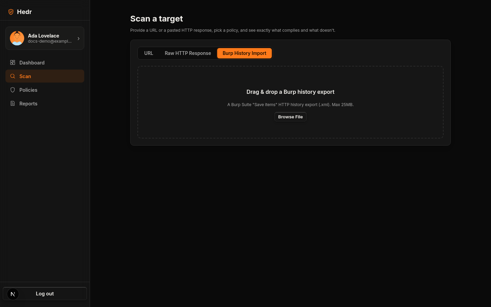

## Policies

A policy is the list of headers you want, the value you expect for each, and whether it's required. Open **Policies** in the sidebar.

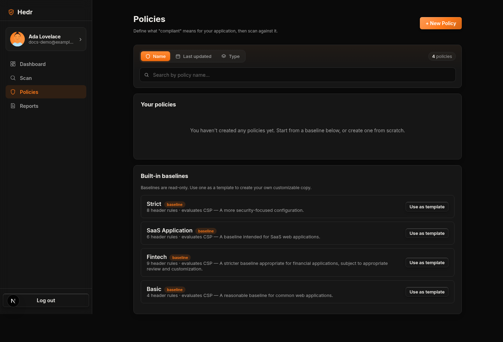

- The four **Baselines** are read-only. Use one as a starting point with **Use as template**.
- Click **+ New Policy** to write your own. Add each header, its expected value (leave it blank to just require the header to be present), and tick **Required** if a missing header should fail. Tick **Evaluate Content-Security-Policy** to add detailed CSP rules.
- Separate several allowed values with `|`, for example `no-referrer|strict-origin`.
- **Clone** a policy of your own to make a variant. Editing a policy creates a new version, and scans always record which version they used.

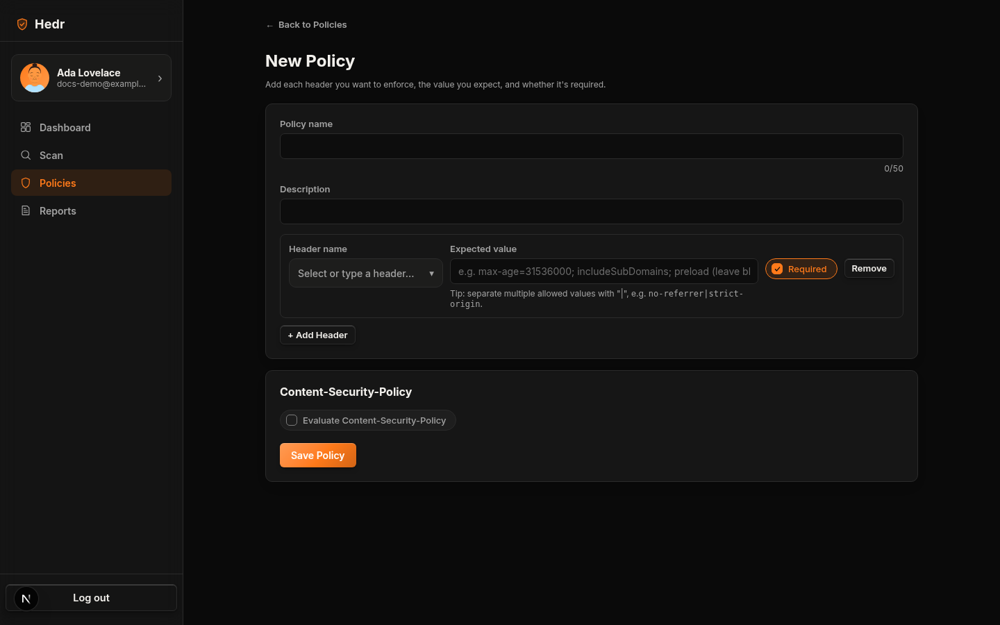

## Account security: two-factor sign-in

Open your **Profile** (click your name in the sidebar) → **Account Security**. **Change Password** works as you'd expect. **Enable MFA** sends a 6-digit code to your account's email address; enter it to turn two-factor sign-in on. From then on, logging in asks for your password and then a fresh code sent to your email (valid for 5 minutes, single use). Turning MFA off needs your current password **and** an emailed code.

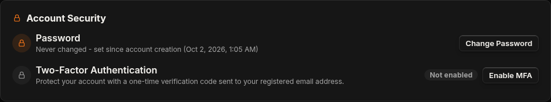

MFA needs the server to be able to send email — see **Email (for MFA)** below. Without it, the Enable MFA button is disabled and says so.

## Configuration

Edit `backend/.env`:

| Setting | Required | What it does |
| --- | --- | --- |
| `JWT_SECRET_KEY` | **Yes** | Signs login sessions. Generate one with `python -c "import secrets; print(secrets.token_hex(32))"`. |
| `GEMINI_API_KEY` | No | Only needed for **Explain with AI**; everything else works without it. |
| `COOKIE_SECURE` | No | Keep `false` for local `http://localhost`; set `true` when served over HTTPS. |

### Email (for MFA)

Two-factor codes are sent over plain SMTP. Set these to enable MFA (see `backend/.env.example`):

```
SMTP_HOST=smtp.gmail.com
SMTP_PORT=587
SMTP_SECURITY=starttls        # starttls | ssl | none
SMTP_USERNAME=you@gmail.com
SMTP_PASSWORD=your-app-password
SMTP_FROM=Hedr Security <you@gmail.com>
```

With Gmail, use an **app password** (Google Account → Security → 2-Step Verification → App passwords), not your normal password. Restart the backend after changing `.env`. Never commit `.env` — it is git-ignored.

> If email delivery is down, accounts with MFA on can't complete sign-in (it fails closed by design).

## Good to know

- URL scans are fetched by the **backend**, and private or internal addresses are blocked on purpose. For a site only reachable through a VPN or internal network, copy its headers and use **Raw HTTP Response** mode.
- Every policy and report is private to the account that created it.
- Reports saved before target types existed show their target type as "Not recorded".
- Signing up does not log you in — you are sent to the login page, so every session starts with a real sign-in.

## Tests

```bash
cd backend
pip install -r requirements-dev.txt
pytest
```

See [`Hedr/Hedr_Idea.md`](Hedr/Hedr_Idea.md) for the original product idea and roadmap.
